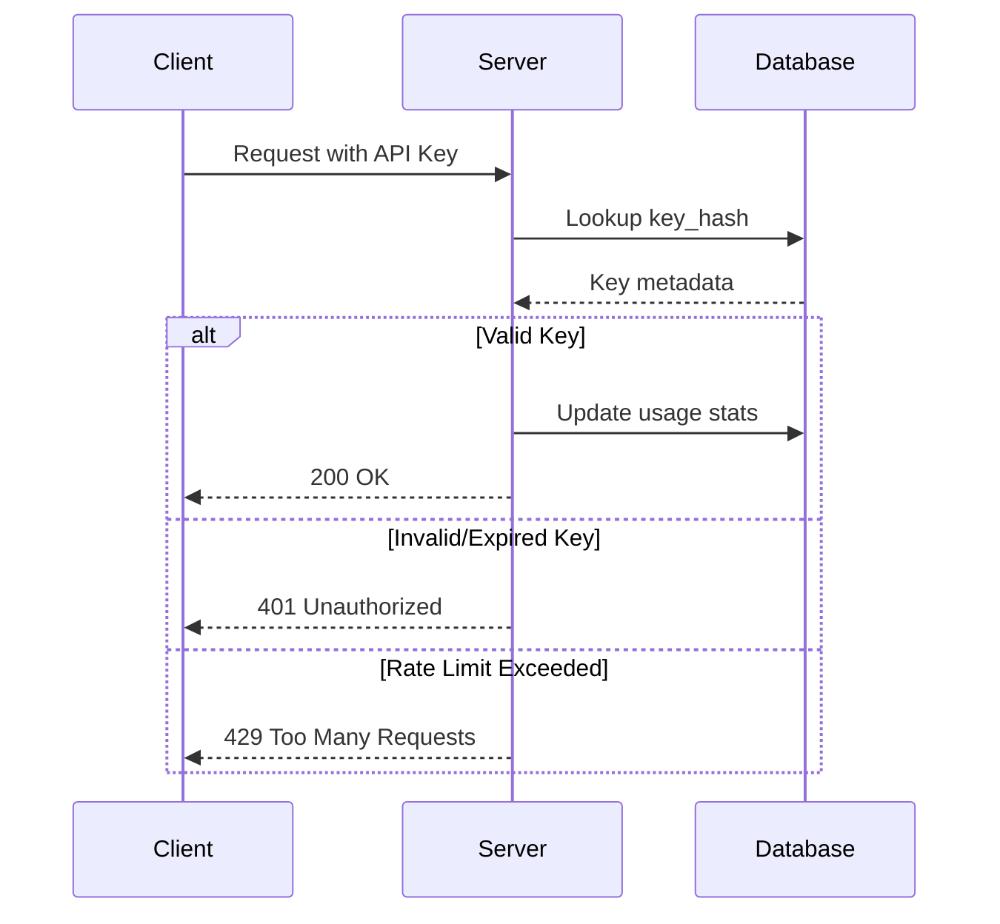

# API Key Authentication Architecture

## Overview

The MCP server implements a secure API key authentication system with:

- Database-backed key storage
- Hashed key validation (SHA-256)
- Configurable rate limiting
- Management endpoints
- Usage tracking

## Database Schema

```sql
CREATE TABLE api_keys (
  apy_key_id TEXT PRIMARY KEY,
  user_id TEXT NOT NULL,
  key_hash TEXT NOT NULL,  -- SHA-256 hash of API key
  description TEXT,
  created_at TIMESTAMP NOT NULL DEFAULT NOW(),
  expires_at TIMESTAMP,
  is_active BOOLEAN NOT NULL DEFAULT TRUE,
  rate_limit INTEGER NOT NULL DEFAULT 100,
  last_used_at TIMESTAMP,
  use_count INTEGER NOT NULL DEFAULT 0
);
```

## Authentication Flow



## Configuration Options

```typescript
interface AuthConfig {
  enabled: boolean;          // Enable/disable auth system
  requireApiKey: boolean;    // Require key for all endpoints
  adminApiKey?: string;      // Master key for management
  defaultRateLimit: number;  // Default requests/minute
  keyRotationDays?: number;  // Auto-expire keys after days
}
```

## Endpoints

### Key Management (Admin)

- `POST /api-keys` - Create new key

  ```json
  {
    "description": "Frontend service",
    "rate_limit": 200,
    "expires_in_days": 90
  }
  ```

- `GET /api-keys` - List all keys (admin only)
- `DELETE /api-keys/:id` - Revoke key

### Authentication

- All endpoints check for `X-API-Key` header
- Alternative: `?api_key=` query parameter

## Usage Example

```javascript
// Client request with API key
fetch('https://mcp-server.example.com/sse', {
  headers: {
    'X-API-Key': 'sk_live_1234567890abcdef'
  }
});
```

## Table Creation

```sql
-- Create using managed table function
SELECT documents.create_managed_table(
  'documents.api_keys',
  'APIK',
  'user_id TEXT NOT NULL,
   key_hash TEXT NOT NULL,
   description TEXT,
   expires_at TIMESTAMP,
   rate_limit INTEGER NOT NULL DEFAULT 100'
);
```

## Security Considerations

- Keys are never stored in plaintext (SHA-256 hashed)
- Leverages managed table's built-in security:
  - Automatic audit fields (created_at, modified_at)
  - is_active and is_deleted flags
  - Reference_data JSONB for extended attributes
- All keys should be rotated periodically
- Rate limits stored in reference_data JSONB
- Admin endpoints require separate master key
- Uses managed table's automatic foreign key constraints
